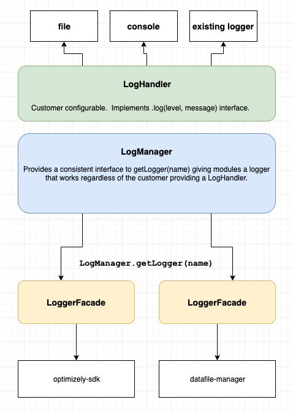

# Javascript SDK Logging

Provides a centralized LogManager and errorHandler for Javascript SDK packages.

## Installation

```sh
npm install @optimizely/js-sdk-logging
```

## Architecture




 - **LogHandler** - the component that determines where to write logs.  Common log handlers
 are `ConsoleLogHandler` or `NoopLogHandler`
 - **LogManager** - returns Logger facade instances via LogManager.getLogger(name)
 - **LoggerFacade** the internal logging interface available to other packages via `LogManager.getLogger(name)`


## Usage


#### Using the logger

```typescript
import { getLogger } from '@optimizely/js-sdk-logging'

const logger = getLogger('myModule')
logger.log('warn', 'this is a warning')

logger.debug('string interpolation is easy and %s', 'lazily evaluated')

logger.info('info logging')
logger.warn('this is a warning')
logger.error('this is an error')

// `info` `warn` `debug` and `error` all support passing an Error as the last argument
// this will call the registered errorHandler
logger.error('an error occurred: %s', ex.message)

// also Error passes to errorHandler.handleError(ex)
logger.error('an error occurred: %s', ex.message, ex)

// if no message is passed will log `ex.message`
logger.error(ex)
```

#### Setting the log level

```typescript
import { LogLevel, setLogLevel } from '@optimizely/js-sdk-logging'

// can use enum
setLogLevel(LogLevel.ERROR)

// can also use a string (lowercase or uppercase)
setLogLevel('debug')
setLogLevel('info')
setLogLevel('warn')
setLogLevel('error')
```


#### Setting a LogHandler

```typescript
import { setLogHandler, ConsoleLogHandler } from '@optimizely/js-sdk-logging'

const handler = new ConsoleLogHandler({
  logLevel: 'error',
  prefix: '[My custom prefix]', // defaults to "[OPTIMIZELY]"
})

setLogHandler(handler)
```

#### Implementing a custom LogHandler

Perhaps you want to integrate Optimizely with your own logging system or use an existing library.

A valid `LogHandler` is anything that implements this interface

```typescript
interface LogHandler {
  log(level: LogLevel, message: string): void
}
```

**Example: integrating with Winston**

```js
import winston from 'winston'
import { setLogHandler, LogLevel } from '@optimizely/js-sdk-logging'

const winstonLogger = winston.createLogger({
  level: 'info',
  format: winston.format.json(),
  defaultMeta: { service: 'optimizely' },
  transports: [
    new winston.transports.File({ filename: 'combined.log' }),
  ],
})

/**
 * Convert from optimizely log levels to winston
 */
function convertLogLevels(level) {
  switch(level) {
    case LogLevel.DEBUG:
      return 'debug'
    case LogLevel.INFO:
      return 'info'
    case LogLevel.WARNING:
      return 'warning'
    case LogLevel.ERROR:
      return 'error'
    default:
      return 'silly'
  }
}

setLogHandler({
  log(level, message) {
    winstoLogger.log({
      level: convertLogLevels(level),
      message,
    })
  }
})
```

### API Interfaces

```typescript
interface LoggerFacade {
  log(level: LogLevel | string, message: string): void

  info(message: string | Error, ...splat: any[]): void

  debug(message: string | Error, ...splat: any[]): void

  warn(message: string | Error, ...splat: any[]): void

  error(message: string | Error, ...splat: any[]): void
}

interface LogManager {
  getLogger(name?: string): LoggerFacade
}

interface LogHandler {
  log(level: LogLevel, message: string): void
}
```